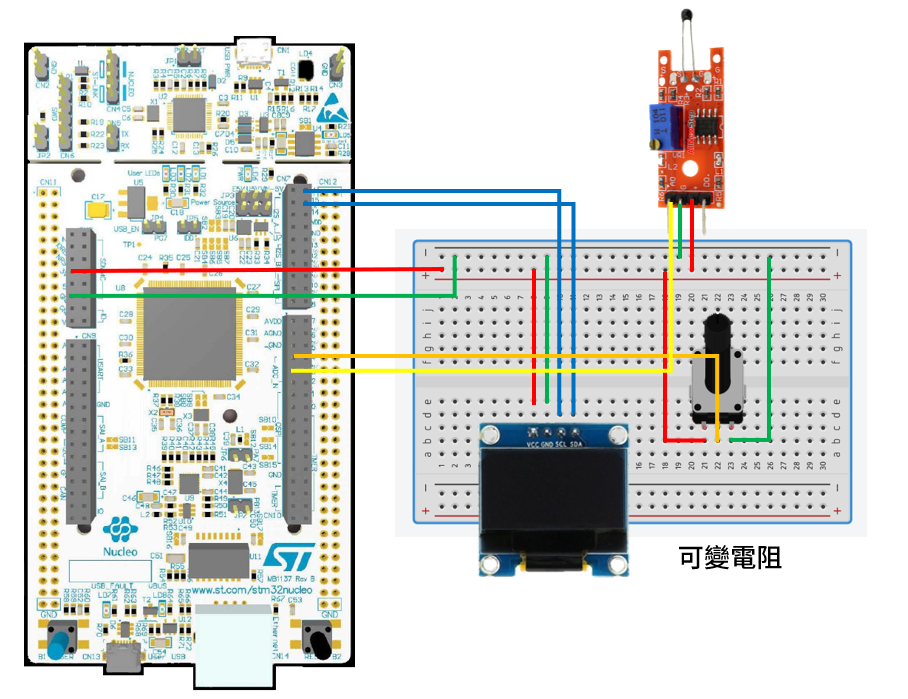

# STM32 Project - 直接記憶體存取

這是一個用於 STM32F4 系列微控制器的示例項目，旨在使用 DMA。

## 硬件要求

- STM32F429ZIT6 微控制器
- OLED 0.96 I2C
- 可變電阻
- 熱敏感測器

## 軟件依賴

- STM32CubeIDE

## 學習目標

- 使用 DMA，轉移數據

## 電路圖

## 構建和編譯

1. 將資料夾放入 STM32CubeIDE 的 WorkSpace 中
2. 在 STM32CubeIDE 中打開 .cproject
3. 編譯並燒寫至您的微控制器

## 使用方法

將編譯好的程序燒寫到 STM32 微控制器後，轉動可變電阻或加熱熱敏感測器，OLED 會顯示其 ADC 數值

## 功能介紹

- DMA 為單次傳輸，每次 start 執行一次
- DMA 為掃描模式，每次有傳輸多個通道的數據
